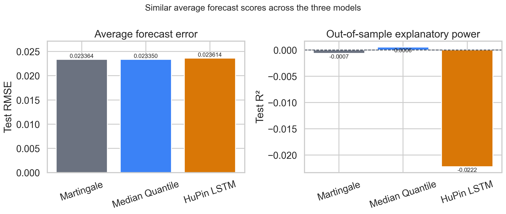
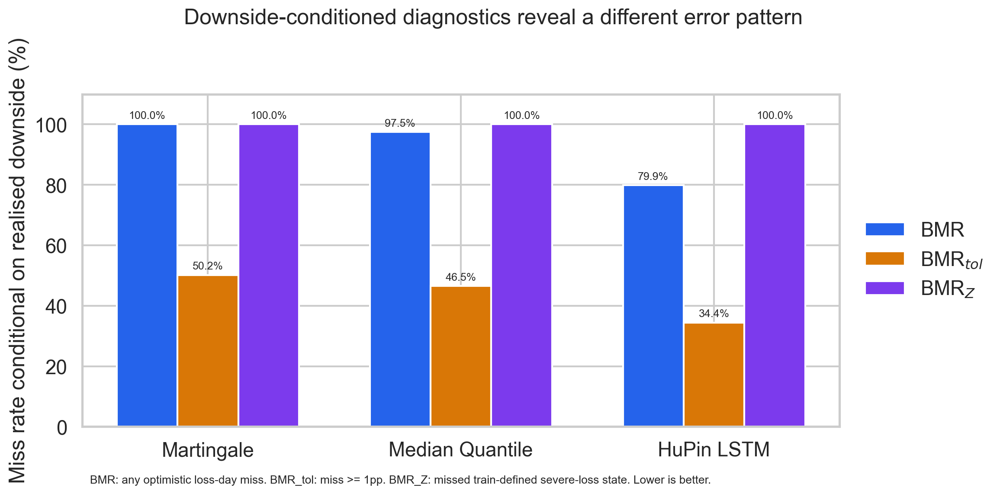

# Bear Miss Rates for Downside Forecast Evaluation

**Author:** [Natalja Talikova](https://orcid.org/0009-0007-5651-4835), Independent Researcher

**Licences:** [MIT for software and notebook code](LICENSE) ·
[CC BY 4.0 for original research text, figures and aggregate tables](LICENSE-CC-BY-4.0.md)

This repository develops the Bear Miss Rate (BMR) approach introduced in the
author's MSc dissertation. BMR supplements central forecast-accuracy measures
by showing how often a point forecast is too optimistic when a loss occurs.

The empirical illustration uses five UK-listed energy securities. They are an
application sample rather than a restriction on the approach: the metrics can
be evaluated for other financial assets and other continuous targets with a
meaningful adverse direction.

## Research outputs

- **Research note:** the Zenodo DOI will be added after publication.
- **Medium article:** the public article link will be added after publication.
- **Code release:** [v1.0.0](https://github.com/NataljaTalikova/msc-tail-risk-aware/releases/tag/v1.0.0).

## The three diagnostics

- **BMR** measures optimistic forecast errors conditional on a realised loss.
- **BMR_tol** counts those errors only when they reach a stated materiality
  threshold. The illustration uses one common value, $\varepsilon=0.01$.
- **BMR_Z** measures missed severe-return events using security-specific
  cutoffs estimated from training data and shared across models.

These diagnostics are reported alongside target-appropriate central accuracy,
bias or calibration, and the cost of excessive conservatism. They are not a
replacement for those measures.

## Empirical illustration

All three forecasts are evaluated on the same 1,575-observation panel: 315
dates for each of five securities from 22 April 2024 to 18 July 2025.

| Model | RMSE | Pooled R² | BMR | BMR_tol | BMR_Z |
|---|---:|---:|---:|---:|---:|
| Zero return (Martingale) | 0.023364 | -0.000655 | 100.0% | 50.2% | 100.0% |
| Median Quantile Regression | 0.023350 | 0.000552 | 97.5% | 46.5% | 100.0% |
| HuPin LSTM | 0.023614 | -0.022224 | 79.9% | 34.4% | 100.0% |

The table is descriptive. The median Quantile and HuPin objectives need not
estimate the same forecast functional, and the comparison does not establish
statistical superiority or trading profitability.





## Repository contents

- `EDA.ipynb` - the data-preparation notebook used by the current pipeline.
- `results.ipynb` - the dissertation-era modelling and results notebook,
  retained as part of the code provenance.
- `src/` - reusable feature, split, model, metric and evaluation functions.
- `paper/train_article_models.py` - tuning and final model fitting.
- `build_common_panel.py` - common-panel construction and evaluation.
- `paper/verify_article_outputs.py` - numerical and structural verification.
- `outputs/paper/` - aggregate tables, selected configurations and figures.
- `paper/DATA_PROVENANCE.md` - data sources, frozen-input fingerprints and the
  redistribution boundary.
- `tests/` - checks for metric boundaries, causal features, purge handling and
  common-panel alignment.

The notebooks contain the MSc project code. The modular `src/` and `paper/`
pipeline provide the maintained release implementation and reproduce the
reported article tables without overwriting the dissertation-era outputs.

## Reproduce the release analysis

Create a Python 3.11 environment and install the pinned dependencies:

```bash
python -m pip install -r requirements.txt
```

Run from the repository root:

```bash
python -m nbconvert --execute --to notebook EDA.ipynb \
  --output EDA_article_executed.ipynb --output-dir paper \
  --ExecutePreprocessor.timeout=1200

python paper/train_article_models.py --model all --stage all \
  --max-epochs 60 --patience 8

python build_common_panel.py
python paper/verify_article_outputs.py
python paper/make_article_figures.py
```

Model tuning is resumable. A quick structural check is available with:

```bash
python paper/train_article_models.py --smoke --model all --stage all
```

## Data and licences

Third-party raw inputs, prepared row-level panels and row-level predictions are
not redistributed. Provider references and frozen-file fingerprints are listed
in [`paper/DATA_PROVENANCE.md`](paper/DATA_PROVENANCE.md). Fresh downloads can
differ from the historical snapshots used for Version 1.0.

Software and notebook code cells are released under the
[MIT licence](LICENSE). Original research prose, explanatory text, figures and
aggregate result tables use the
[Creative Commons Attribution 4.0 International licence](LICENSE-CC-BY-4.0.md).
Third-party data remain subject to their source terms.

## Citation

Citation metadata are provided in [`CITATION.cff`](CITATION.cff). Cite the
Version 1.0 research note for the BMR formulation and this repository release
for the software implementation.
